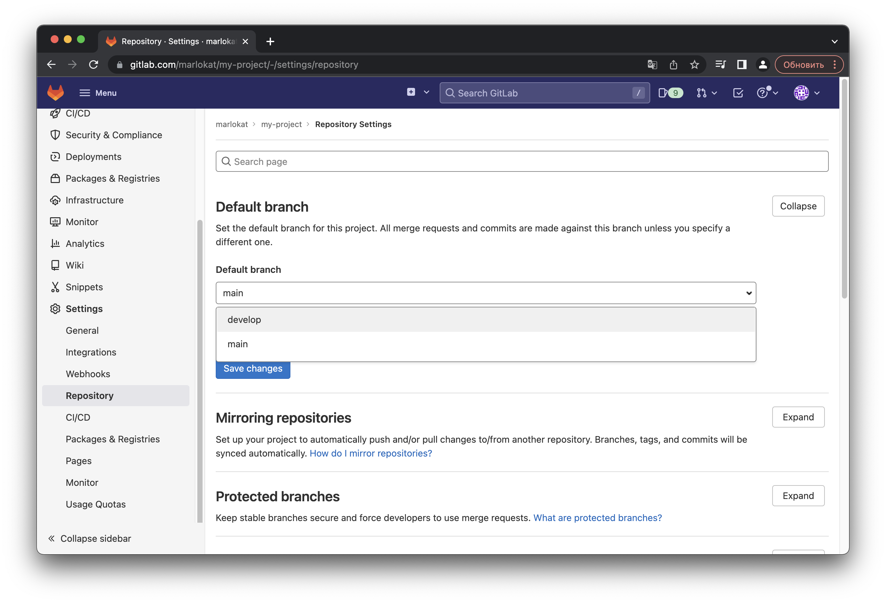

<!-- Hello School 21 from marlokat ;) -->

<style>
    red { color: red }
    blue { color: blue }
</style>

# Мануал по использованию GitLab

**GitLab** – это популярная платформа для управления системой версий `git` с открытым исходным кодом. Данный мануал призван помочь начинающим пользователям с ознакомлением с главными функциями данной платформы.

> Содержание

1. Создание личного репозитория с нужным .gitignore и простым README.MD
2. Создание веток develop и master
3. Установка ветки develop по умолчанию
4. Создание issue на создание текущего мануала
5. Создание ветки по issue
6. Создание merge request по ветке в develop
7. Комментирование и принятие реквеста
8. Формирование стабильной версии в master с простановкой тега
9. Работа с wiki проекта

## Создание репозитория

Создать репозиторий можно двумя способами: либо <red>создав пустой проект</red>, либо <blue>создав его из шаблона</blue>:

<center>
    
</center>

### Создание пустого репозитория

В первом случае откроется страница с настройками репозитория, где нужно указать название проекта _(можно использовать пробелы для повышенной читаемости)_, ссылку на проект _(project slug будет идти после никнейма)_, а также можно добавить описание и инициализировать проект файлом `README.md`. Данный файл, _как и этот мануал_, использует язык разметки [Markdown](https://wikipedia.org/wiki/Markdown) и он будет показываться на главной странице как описание проекта. Считается хорошей практикой в данном файле описать, как запустить проект, как им пользоваться и как он выглядит.

<center>
    
    <br>
    <em>Создание пустого репозитория</em>
</center>

### Создание репозитория из шаблона

Если же выбрано создание репозитория из шаблона, появятся варианты, из которых можно выбрать, как будет выглядеть "скелет" проекта сразу после создания, а далее необходимо будет указать те же данные, что на скриншоте выше.

<center>
    
</center>

### Создание локального репозитория

Локальный репозиторий можно создать с помощью **CLI** – консольного инструмента для работы с `git`. Для этого необходимо выполнить следующие команды:

```sh
# Инициализация локального репозитория в директории my-project
git init my-project

# Переход в директорию локального репозитория
cd my-project
```

После этого репозиторий будет создан. Также одной из правильных практик ведения `git` репозиториев является создание и заполнение файла `.gitignore` _(точка в начале – это не ошибка, она указывает, что файл является скрытым)_.

> Файл `.gitignore` используется для указания, какие файлы игнорируются системой управления версиями. Это, как правило, артефакты сборки и файлы, генерируемые машиной из исходных файлов в вашем репозитории, либо файлы, которые по какой-либо иной причине не должны попадать в коммиты, такие как логи, настройки IDE, скомпилированный код.

Его можно создать либо вручную, либо взять уже готовые шаблоны, которые были составлены под каждый язык: [репозиторий от создателей GitHub](https://github.com/github/gitignore). Также существуют генераторы файла `.gitignore`. Они полезны, когда проект состоит из нескольких частей, написанных на разных языках программирования. Примером таких генераторов служит [генератор от toptal.com](https://www.toptal.com/developers/gitignore).

После создания файла необходимо его добавить в список обновляемых файлов:

```sh
git add .gitignore
```

Так же необходимо поступать с каждыми новыми файлами и директориями в репозитории.

После этого нужно настроить репозиторий с помощью команды `git config`:

```sh
# Установка e-mail для подписи коммитов
git config user.email "mail@example.com"
```

Далее подключаем локальный репозиторий к удалённому с помощью HTTPS:

```sh
# Подключение к удаленному репозиторию через HTTPS
# Вместо такого адреса должен быть ваш репозиторий
git remote add origin https://repos.21-school.ru/marlokat/my-project
```

Либо с помощью SSH:

```sh
# Подключение к удаленному репозиторию через SSH
# Вместо такого адреса должен быть ваш репозиторий
git remote add origin git@repos-ssh.21-school.ru:2289/marlokat/my-project
```

## Создание веток

> Ветки нужны для того, чтобы программисты могли вести совместную работу над проектом и не мешать друг другу при этом. При создании проекта, Git создает базовую ветку. Она называется `master` веткой. Она считается центральной веткой, т.е. в ней содержится основной код приложения.

Ветка `master`, как уже было указано выше, является базовой веткой, которая создаётся вместе с проектом. Однако код в неё напрямую загружать не нужно. Правильным решением будет создать ветку `develop` на основе ветки `master`, чтобы не нарушать основную функциональность программы во время разработки. Это можно сделать с помощью следующих команд _(необходимо находиться в директории локального репозитория, как и для работы всех остальных команд `git`)_:

```sh
# Создание ветки develop и переключение на неё
git checkout -b develop master
```

Таким образом, ветка `develop` создана! Но необходимо её также создать на удалённом репозитории и связать локальную ветку с удалённой:

```sh
# Пуш активной локальной ветки в удалённую ветку develop
git push -u origin develop
```

После этого ветка будет видна в веб-интерфейсе GitLab:

<center>
    
</center>

## Установка ветки по умолчанию

Так как в основном код будет появляться в ветке `develop`, было бы здорово установить её веткой по умолчанию. Для этого можно воспользоваться веб-интерфейсом, перейдя по пути Settings -> Repository -> Default branch, выбрать в комбо-боксе ветку `develop` и применить изменения:

<center>
    
</center>

Но также можно воспользоваться командным интерфейсом утилиты `git`:

```sh
# Для установки стандартной ветки для всех репозиториев
git config --global init.defaultBranch develop

# Для установки стандартной ветки для текущего репозитория
git config init.defaultBranch develop
```

## Issue Tracker

Система Issue Tracker позволяет получать обратную связь от пользователей и разработчиков. Путём issue создаются сообщения о багах, ошибках, пожеланиях к проекту. Также их могут открывать сами создатели репозитория для ведения журнала выполненных и не выполненных заданий. Для примера сделаем Issue для написания этого мануала. Перейдём в меню Issues. Если ни одного issue ещё не было, интерфейс предлагает сразу же его создать:

<center>
    
</center>

После нажатия на кнопку New Issue откроется стандартный интерфейс создания issue. Тут нужно указать заголовок, остальные поля опциональны, но описание поможет более конкретно раскрыть проблему. Также можно указать дедлайн – конечную дату исполнения issue, и назначить конкретного участника или участников команды на выполнение. После окончания заполнения полей можно отправить issue.

<center>
    
</center>

### Создание ветки по issue

После получения issue можно создать ветку для решения проблемы, описанной в нём. Это делается с помощью синей кнопки под телом issue:

<center>
    
</center>

### Merge Request

После выполнения действий для разрешения issue, ветка по этому issue выглядит так:

<center>
    
</center>

Теперь нужно подлить данные изменения в ветку `develop`, чтобы их можно было использовать в проекте. Для этого вернёмся к issue и нажмём синюю кнопку Create merge request:

<center>
    
</center>

Откроется окно создания "запроса на слияние" (Merge Request), где автоматически может быть проставлен префикс `Draft` (черновик). Такой запрос необходимо будет дополнительно принять, но если убрать этот префикс, это поведение отключится.

<center>
    
</center>

#### Комментирование и принятие Merge Request

После создания Merge Request, он появится в соответствующем пункте левого меню. При нажатии на него покажется вся информация о его коммитах, участниках и сообщениях. В поле снизу можно обсуждать проблему. Если все в порядке, кнопка Merge позволит слить изменения в выбранную ветку. Параметр `Delete source branch` даст возможность удалить изначальную ветку, созданную по issue, чтобы веток не было слишком много. После подтверждения слияния ветка удалится, а её изменения перейдут в ветку, выбранную для слияния.

<center>
    
</center>

## Теги

Для наглядной навигации по репозиторию _(которые, к слову, могут быть гигантскими)_ можно использовать такой удобный инструмент, как Теги (Tags). Обычно теги нужны для маркировки стабильных и нестабильных версий продукта, чтобы конечный пользователь имел в виду, что на нестабильной ветке возможны проблемы, а разработчики, желающие помочь в развитии проекта, выбирали последнюю версию и модернизировали её.

<center>
    
</center>

При создании тега также можно указать Release Notes _(поддерживается Markdown)_, и тогда автоматически создастся релиз (выпуск) проекта. Обычно релизы делают либо из стабильных версий (например, как в данном случае) либо из тестируемых версий (альфа/бета тест).

<center>
    
</center>

## Wiki

Для сложных и объёмных проектов бывает необходимо создавать документацию. Для этого идеально подходят вики-страницы, по которым реализована удобная навигация. Для создания вики проекта необходимо перейти на вкладку Wiki в левом меню и нажать Create wiki page.

У каждой страницы есть название, тело и сообщение коммита. Тело страницы поддерживает язык разметки [Markdown](https://wikipedia.org/wiki/Markdown), за счёт чего можно реализовать красиво оформленные страницы с возможностью заострить внимание на важных моментах, а также создавать таблицы, прикреплять файлы, документы и т.д.

<center>
    
</center>

Вот пример оформленного документа:

<center>
    
</center>

Таким образом можно заполнять большие страницы и указывать ссылки на разделы.

---

> Мануал подготовил [marlokat](mailto:marlokat@student.21-school.ru) в рамках бонусного квеста 2 дня. Hello School 21 ;)
